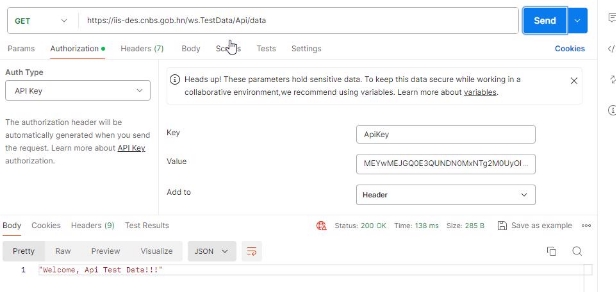
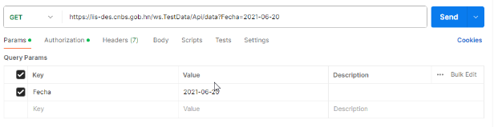

<h1 align="center"><strong>Evaluación de conocimientos</strong></h1>

## 1\. Generalidades   

El propósito de esta prueba es evaluar su conocimientos y habilidades de análisis y programación  

Para esta prueba se requiere lo siguiente:  

1. Se requiere crear un servicio, api, programa o algún tipo de procedimiento que consuman un servicio REST para obtener la información de prueba de ciertas declaraciones.  

*a.* Esta información debe ser almacenada para posteriormente ser consultada (*Si se almacena en una base de datos, de preferencia que sea en SQL SERVER o MySQL)*  

2. Se debe crear un sitio el cual permita la búsqueda de declaraciones por el campo **Nddtimmioe**, dicho sitio deberá mostrar todas las declaraciones que coincidan con la búsqueda y mostrar el detalle de artículos de cada una de las declaraciones en un formato de Maestro-Detalle. También se debe poder visualizar la información de las liquidaciones de dicha liquidación y/o Articulos.   

**El sitio de debe crear usando C# o VB.net**  

A continuación se detalla también la estructura de las respuestas XML y JSON para los mensajes.**  

## 2. Contexto de Uso del Servicio   

URL de Pruebas   

Test de Servicio Activo (GET):   

[https://iis-des.cnbs.gob.hn/ws.TestData/api/data](https://iis-des.cnbs.gob.hn/ws.TestData/api/data)Servicio 

para obtener los Datos (GET):   [https://iis-des.cnbs.gob.hn/ws.TestData/api/data?Fecha={FechaConsultar} ](https://iis-des.cnbs.gob.hn/ws.TestData/api/data?Fecha=%7bFechaConsultar%7d)

## 3. Forma de Consumo del Servicio REST    

**Autenticación**  

El método de autentificación será “ApiKey” que se debe agregar en el Header.   ![ref1]



**Método para obtener los Datos**  

Forma de petición GET, recibe un parámetro Fecha con formato yyyy-MM-dd método de autenticación “ApiKey”  



**Consideraciones**

El servicio devuelve una respuesta en formato XML, esta respuesta tiene un campo **datosComprimidos** que de tipo cadena, es una cadena en base64 que ha sido comprimida para aligerar la consulta.  Al descomprimir este campo se obtiene una cadena en formato JSON con toda la información de las declaraciones, en este mismo documento se proporciona una función para descomprimir dicha cadena.  

## 4. Consultar Información de Declaraciones   

Las fechas que han sido habilitadas para la prueba son:  

- 2021-06-20  
- 2021-06-21  
- 2021-06-22  
- 2021-06-23  
- 2021-06-24  

Si se consulta otra fecha el servicio devolverá un código 404 No Found  

**Mensaje de Respuesta Satisfactoria INFO-R**

El servicio devuelve la respuesta en formato XML  

Los datos contenidos en la respuesta se listan a continuación:   


|Elemento   |Tipo de Datos  |` `Req. |` `Descripción   |
| - | - | - | - |
|nroTransaccion (atributo)   |Entero Largo   |Si   |Número único de transacción.   |
|fechaHoraTrn (atributo)   |Fecha y Hora   |Si   |Fecha y hora de transacción en Sistema Aduanero.   |
|fechaAConsultar   |Texto (10)   |Si   |Fecha consultada en formato YYYY-MM-DD. Mismo parámetro de entrada.   |
|cuentaDeclaraciones   |Entero (4)   |Si   |Cantidad de declaraciones devueltas.   |


|datosComprimidos   |Texto   |Si   |Array de datos de declaraciones en formato JSON comprimidos en formato Base64. *Véase los siguientes tópicos para entender la estructura.*   |
| - | - | - | :- |

Ejemplo de estructura XML para la respuesta:   

```xml
<INFO-R nroTransaccion="" fechaHoraTrn="">
    <fechaAConsultar/>
    <cuentaDeclaraciones/>
    <datosComprimidos/>
</INFO-R>
```

Estructura de Datos de Declaraciones en Formato JSON   

Las relaciones son las siguientes:   

Las DDT (Declaración) **tiene una** LIQ (Liquidación)  

Las DDT (Declaración) **puede tener múltiples** ART (Artículos)  

Los ART (Artículos) **pueden tener múltiples** LIQART (Liquidaciones de Artículos)  

La estructura de datos contenidos en el formato JSON se listan a continuación, los campos marcados en amarillo son los campos llave:   


|Elemento   |Tipo de Datos   |Req. |
| - | - | - |
|**DDT (Declaraciones)**  |**Grupo**   |**Si**   |
|Iddtextr   |Texto (17)   |Si   |
|Cddtver   |Entero (3)   |Si   |
|Iddtext   |Texto (17)   |Si   |
|Iddt   |Texto (17)   |Si   |
|Iext   |Texto (40)   |No  |
|Cddteta   |Texto (4)   |Si   |
|Dddtoficia   |Fecha Hora   |Si   |
|Dddtrectifa   |Fecha Hora   |No  |
|Cddtcirvis   |Texto (1)   |No  |
|Qddttaxchg   |Número (12,6)   |Si   |
|Ista   |Texto (4)   |Si   |
|Cddtbur   |Texto (4)   |Si   |
|Cddtburdst   |Texto (4)   |No  |
|Cddtdep   |Texto (4)   |No  |


|Cddtentrep   |Texto (4)   |No  |
| - | - | - |
|Cddtage   |Texto (5)   |Si   |
|Cddtagr   |Texto (14)   |No  |
|Lddtagr   |Texto (100)   |No  |
|Nddtimmioe   |Texto (14)   |Si   |
|Lddtnomioe   |Texto (100)   |Si   |
|Cddtpayori   |Texto (2)   |No  |


|Cddtpaidst   |Texto (2)   |No  |
| - | - | - |
|Lddtnomfod   |Texto (150)   |No  |
|Cddtincote   |Texto (3)   |No  |
|Cddtdevfob   |Texto (3)   |Si   |
|Cddtdevfle   |Texto (3)   |No  |
|Cddtdevass   |Texto (3)   |No  |
|Cddttransp   |Texto (5)   |No  |
|Cddtmdetrn   |Texto (1)   |No  |
|Cddtpaytrn   |Texto (2)   |No  |
|Nddtart   |Entero (4)   |Si   |
|Nddtdelai   |Entero (3)   |No  |
|Dddtbae   |Fecha Hora   |No  |
|Dddtsalida   |Fecha Hora   |No  |
|Dddtcancel   |Fecha Hora   |No  |
|Dddtechean   |Fecha    |No  |
|Cddtobs   |Texto (500)   |No  |
|**LIQ (Liquidación)**  |**Grupo**   |**Si**   |
|Iliq   |Texto (17)   |Si   |
|Cliqdop   |Texto (17)   |Si   |
|Cliqeta   |Texto (3)   |Si   |
|Mliq   |Número (18,2)   |Si   |
|Mliqgar   |Número (18,2)   |Si   |
|dlippay   |Fecha Hora   |No  |


|Clipnomope   |Texto (20)   |No  |
| - | - | - |
|**LQA (Liquidación Articulos)**  |**Listado de Grupo**|`  `**No**  |
|Iliq   |Texto (17)   |No  |
|Nart   |Entero (4)   |No  |
|Clqatax   |Texto (3)   |No  |
|Clqatyp   |Texto (1)   |No  |
|Mlqabas   |Número (18,4)   |No  |
|Qlqacoefic   |Número (18,6)   |No  |
|Mlqa   |Número (18,4)   |No  |
|**ART (Articulos)**  |**Listado de Grupo**|`  `**Si**   |
|Iddt   |Texto (17)   |Si   |
|Nart   |Entero (4)   |Si   |
|Carttyp   |Texto (1)   |Si   |
|Codbenef   |Texto (15)   |Si   |
|Cartetamrc   |Texto (2)   |No  |
|Iespnce   |Texto (17)   |Si   |
|Cartdesc   |Texto (500)   |Si   |
|Cartpayori   |Texto (2)   |No  |
|Cartpayacq   |Texto (2)   |No  |
|Cartpayprc   |Texto (2)   |No  |
|Iddtapu   |Texto (17)   |No  |
|Nartapu   |Entero (4)   |No  |
|Qartbul   |Número (18,2)   |No  |
|Martunitar   |Número (18,4)   |No  |
|Cartuntdcl   |Texto (2)   |No  |
|Qartuntdcl   |Número (18,2)   |No  |
|Cartuntest   |Texto (2)   ||
|Qartuntest   |Número (18,2)   |No  |
|Qartkgrbrt   |Número (18,3)   |No  |
|Qartkgrnet   |Número (18,3)   |No  |
|Martfob   |Número (18,2)   |Si  |
|Martfobdol   |Número (18,2)   |No  |
|Martfle   |Número (18,2)   |No  |
|Martass   |Número (18,2)   |No  |
|Martemma   |Número (18,2)   |No  |
|Martfrai   |Número (18,2)   |No  |
|Martajuinc   |Número (18,2)   |No  |
|Martajuded   |Número (18,2)   |No  |
|Martbasimp   |Número (18,2)   |Si  |

Ejemplo de estructura de datos de Declaraciones en formato JSON se pude visualizar en el JSON adjunto.

**Mecanismo de Compresión y Descompresión de Textos JSON**

Esta sección refiere los códigos fuentes validados y probados de métodos para hacer la compresión y descompresión de textos XML pasados como parámetros o recibidos como respuesta. Se anexan las fuentes en lenguaje C#.net   

**Código de los métodos Compress y Decompress en C#.net.**


```python 
// Comprime una cadena de texto
private static string Compress(string text)
{
    byte[] buffer = Encoding.UTF8.GetBytes(text);
    MemoryStream ms = new MemoryStream();
    using (GZipStream zip = new GZipStream(ms, CompressionMode.Compress, true))
    {
        zip.Write(buffer, 0, buffer.Length);
    }

    ms.Position = 0;
    MemoryStream outStream = new MemoryStream();

    byte[] compressed = new byte[ms.Length];
    ms.Read(compressed, 0, compressed.Length);

    return Convert.ToBase64String(compressed);
}
```
```python 
// Decomprime una cadena de texto (comprimida con Compress)
public static async System.Threading.Tasks.Task<string> DecompressAsync(string compressedString)
{
    try
    {
        using (MemoryStream msi = new MemoryStream(Convert.FromBase64String(compressedString)))
        using (MemoryStream mso = new MemoryStream())
        {
            using (var gs = new GZipStream(msi, CompressionMode.Decompress))
            {
                await gs.CopyToAsync(mso);
            }
            return Encoding.UTF8.GetString(mso.ToArray());
        }
    }
    catch (Exception ex)
    {
        throw ex;
    }
}
```
